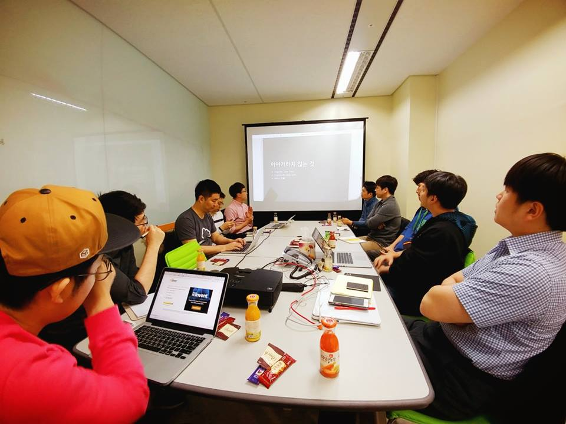

## 판교 지역 모임
### 판교 소모임
- 1차: 2019년 2월 13일

  

  

  

  

- 발표 자료 : [도커와 쿠버네티스 기초 - 최용호](https://www.slideshare.net/secret/fnPUmHBC0DYCqB)

### 판교 초급자 모임
- 1차: 2017년 1월 19일

### 판교 중급자 모임
- 3차: [2017년 2월 9일](https://www.meetup.com/ko-KR/awskrug/events/237355577/)
  - [Build Custom AMI With Packer](https://github.com/giseongeom/presentations/blob/master/2017/2017.02.09-AWS-pangyo-mid/ec2-custom-ami-with-packer.pdf)
  - [CloudFront](https://docs.google.com/presentation/d/1IIpg85ycTGsVbxDr1lamtJMRbsTVsR5iJa3aFbYyfCE/edit?usp=sharing)
  - 
- 2차: [2017년 1월 6일](https://www.meetup.com/awskrug/events/236661048/)
  - [AWS Cognito Federation Identity의 사용법과 역할 - 박진언](https://jinunpark.github.io/awskrug_20170106_introduction_to_aws_cognito)
  - [클라우드에서의 보안 - 정도현](http://www.slideshare.net/AmazonWebServices/intro-to-aws-security-50364629)
  - [AWS re:invent 2016 후기 - 정창훈](http://www.slideshare.net/seapy/aws-reinvent-2016)
  - [OpenSSL에 얽힌 비화](https://coolspeed.wordpress.com/2015/02/16/unseeable_comrade_in_arms/)
  - 
- 1차: 2016년 12월 8일
