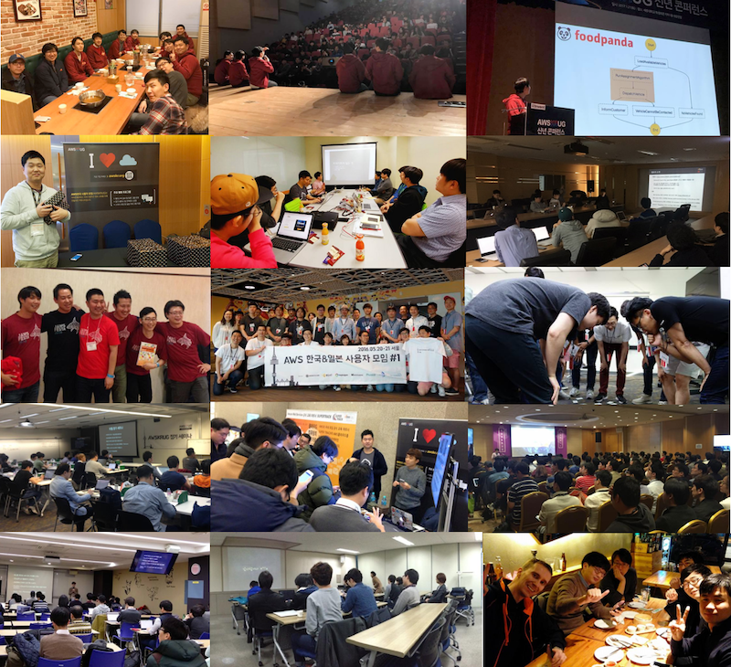

AWS한국 사용자 모임에서는 다양한 정기 모임 및 분야별/지역별 소모임을 운영하고 있습니다. 관심이 있는 분들은 누구나 발표 및 참여하실 수 있습니다. [소모임 포함 행사 일정](http://www.awskr.org/groups/)은 AWSKRUG [페이스북 그룹](http://www.facebook.com/groups/awskrug)이나 [슬랙 채널](http://www.awskr.org/slack)을 참고하세요.

## 바로가기
- [소모임](#%EC%86%8C%EB%AA%A8%EC%9E%84): 강남 및 판교 등 지역 모임, 자격증 취득등 분야별 모임
- [기술 콘퍼런스](#%EA%B8%B0%EC%88%A0-%EC%BD%98%ED%8D%BC%EB%9F%B0%EC%8A%A4): 연간 기술 콘퍼런스
- [기술 세미나](#%EC%A0%95%EA%B8%B0-%EC%84%B8%EB%AF%B8%EB%82%98): 분기(혹은 월별) 정기 세미나
- [비정기 모임](#%EB%B9%84%EC%A0%95%EA%B8%B0-%EB%AA%A8%EC%9E%84): 각종 실습 행사 및 워크샵

# 소모임
AWSKRUG에서는 분야별 혹은 지역별로 다양한 소모임을 만들어 운영하고 있습니다. 각 소모임을 활성화 하기 위해 아래와 같은 지원 패키지를 준비하였습니다. 소모임을 운영하거나 참여하자 하시는 분은 http://www.awskr.org/groups/ 페이지를 참고하시기 바랍니다.(매월 일정도 확인하실 수 있습니다.)     
## [강남 모임](Gangnam-Group.md)
### 강남비기너
### 강남 중급
### 강남 SE
## [판교 모임](Pankyo-Group.md)
### 판교 중급
### 판교 SE
## [구로디지털 모임](https://github.com/awskrug/gudi-group)
## 부산 모임
## 원주 모임
## [서버리스 모임](https://github.com/awskrug/serverless-group) 
## [컨테이너 모임](https://github.com/awskrug/container-group) 
## [CLI 모임](https://github.com/awskrug/cli-group) 
## [아키텍처 모임](https://github.com/awskrug/architecture-group)
## [데이터사이언스 모임](https://github.com/awskrug/datascience-lab)
## [대학생 모임](https://github.com/ausg)
## 엔터프라이즈 모임
## 자격증 모임
## 주니어 모임
## 경력개발 모임 
## 디자이너 모임
## [MXNet 모임](https://www.meetup.com/MXNet-Korea-User-Group/) Spin-off!
## [Chaos Engineering 모임](https://www.meetup.com/Korea-Chaos-Engineering-Community/) Spin-off!

# 정기 모임
AWSKRUG에서는 100-300명 규모의 분기 및 반기별로 주제별 정기 세미나 및 기술 콘퍼런스를 개최하고 있습니다.

## 기술 콘퍼런스
### 2017 re:Invent 특집 (2018.1.26)
- [Amazon AI 신규 서비스 맛보기 - 딥러닝에서 AI서비스까지](https://www.youtube.com/watch?v=xEn-e-i5fHc&list=PLORxAVAC5fUV_2Z7mZXteMJ4LXjIJqvXj&index=4&t=9s) – 윤석찬 테크에반젤리스트
- [머신 러닝으로 유창해지는 AWS의 언어 실력](https://www.youtube.com/watch?v=UHcMm09nPcY&list=PLORxAVAC5fUV_2Z7mZXteMJ4LXjIJqvXj&index=5&t=0s) – 황준우 | 멋쟁이 사자처럼 
- [사물 인터넷을 위한 AWS FreeRTOS 소개](https://www.youtube.com/watch?v=Qjea62zxDX8&list=PLORxAVAC5fUV_2Z7mZXteMJ4LXjIJqvXj&index=6&t=0s) – 오회근 | 강남 중급자 모임
- [Amazon MQ – 쉽게 시작하는 메시지 브로커 서비스](https://www.youtube.com/watch?v=rSNBPvXz1Oc&list=PLORxAVAC5fUV_2Z7mZXteMJ4LXjIJqvXj&index=7&t=0s) – 장준엽 | 구로디지털 모임 
- [App Sync, 모바일 개발을 위한 GraphQL as a Service](https://www.youtube.com/watch?v=chUsMVg04nU&list=PLORxAVAC5fUV_2Z7mZXteMJ4LXjIJqvXj&index=8&t=30s) – 원지혁 | 대학생 모임
- [AWS 서버리스 신규 서비스 총정리](https://www.youtube.com/watch?v=PTgli1_Z1Ao&list=PLORxAVAC5fUV_2Z7mZXteMJ4LXjIJqvXj&index=9&t=0s) – 김현민 | 서버리스 모임
- [AWS로 돌아온 Cloud9, 클라우드 IDE 활용법](https://www.youtube.com/watch?v=Iq90bFh1wrI&list=PLORxAVAC5fUV_2Z7mZXteMJ4LXjIJqvXj&index=10&t=0s) – 김탁희 | 멋쟁이 사자처럼 
- [ECS/Fargate와 함께하는 간편한 Docker 사용법](https://www.youtube.com/watch?v=bEr_98NRlzc&list=PLORxAVAC5fUV_2Z7mZXteMJ4LXjIJqvXj&index=11&t=1492s) – 변규현 | 컨테이너 모임
- [Aurora Serverless, 서버리스 RDB의 서막](https://www.youtube.com/watch?v=6j-QyBqu3fg&list=PLORxAVAC5fUV_2Z7mZXteMJ4LXjIJqvXj&index=12&t=0s) - 김영헌 | 구로디지털 모임 
- [S3 Select를 통한 빠른 데이터 분석하기](https://www.youtube.com/watch?v=hkU4I7MhIfs&list=PLORxAVAC5fUV_2Z7mZXteMJ4LXjIJqvXj&index=13&t=0s) – 김명보 | 센드버드
- [Amazon SageMaker와 Deep Lens를 통한 딥러닝 모델 워크샵](https://github.com/awskrug/reinvent2017-recap-workshop) - 류한진/최선근 | 데이터사이언스 모임

### [2016 re:Invent 특집](http://onoffmix.com/event/84915) (2017.1.21)
- [개발자를 위한 Amazon Lightsail Deep-Dive](http://www.slideshare.net/awskr/amazon-lightsail-deepdive-71332528), 정창훈 (당근마켓 개발자)
- [Amazon Athena를 통한 데이터 분석하기](http://www.slideshare.net/awskr/amazon-athena-zeppelin), 김명보(VCNC 개발자)
- [Amazon Lex를 이용한 초간단 인공지능 챗봇 만들기](http://www.slideshare.net/awskr/aws-lex), 이두희 (멋쟁이 사자처럼)
- [AWS Step Functions을 통한 서버리스 마이크로서비스 만들기](http://www.slideshare.net/awskr/aws-step-functions-4csoft), 김현민(4CSoft 개발자)
- [Blox: Docker 클러스터링에 ECS만으로는 부족하셨다고요?](http://www.slideshare.net/awskr/blox-docker-ecs), 유은총 (스포카 개발자)
- [실시간 유동 인구 측정을 위한 서버리스 분석 플랫폼 구축 사례](http://www.slideshare.net/awskr/aws-zeroweb), 김승연 (제로웹 CTO)
- [AWS re:Invent 신규 서비스 총정리](https://www.slideshare.net/awskr/reinvent-recap-for-awskrug), 윤석찬 (AWS 테크에반젤리스트)
- [녹화 동영상 및 스케치 모음](https://www.youtube.com/playlist?list=PLORxAVAC5fUUhOFLwydw9wKDtL-tv60z_)

### [2015 re:Invent 특집](http://onoffmix.com/event/55782) (2015.11.7)
- [re:Invent 2015 신규 서비스 소개- 데이터 관점에서](http://www.slideshare.net/awskr/awskrug-reinvent-iot) - 윤석찬, AWS 테크에반젤리스트
- re:Invent 주요 신규 기술 소개 - 모바일, IoT 중심으로, 정민영, 비트패킹컴퍼니
- re:Invent 행사 후기 - 사용자 관점에서 - 김명보, VCNC
- [re:Invent 앵콜세션] [DAT202 – Managed Database Options on AWS](http://www.slideshare.net/AmazonWebServices/dat202-managed-database-options-on-aws#54) - 백정상, IGAWorks  
- [re:Invent 앵콜세션] [GAM201 – Cloud Gaming Architectures from Mobile to Social to MMO](http://www.slideshare.net/AmazonWebServices/gam201-cloud-gaming-architectures-from-mobile-to-social-to-mmo#18) - 안재만, 데브시스터즈
- re:Invent 행사 후기 - 파트너사 관점에서 - 박정수, GS네오텍/ 기영삼, 메가존
- [re:Invent 주요 서비스 요약 - 인프라 및 보안 기술 변화](http://www.slideshare.net/awskr/awskrug-reinvent) - 박상욱, 클라우드노아

## 정기 세미나
### AWS Summit 2018 - Community Track (2018.4.17-18)
- [Kotlin과 AWS와 함께라면 육군훈련소도 외롭지 않아](https://www.slideshare.net/awskorea/kotlin-aws-lambda), 강성훈 (레이니스트)
- [Zappa를 통한 서버리스 마이크로서비스 구축하기](https://www.slideshare.net/awskorea/serverless-microservice-with-zappa-94463985), 송윤섭(에이비일팔공)
- [AWS Lambda를 통한 Tensorflow 및 Keras 기반 추론 모델 서비스하기](https://www.slideshare.net/awskorea/aws-lambda-tensorflow-keras-inferences), 이준범 (넥슨코리아)
- [Serverless Architecture를 응용한 실시간 DW 플랫폼 구현](https://www.slideshare.net/awskorea/power-plantsolarpoweranalysissystemusingserverlessarchitecturesuhjihyeong), 서지형 (해줌)
- [Serverless로 이미지 크롤링 프로토타입 개발기](https://www.slideshare.net/awskorea/college-student-user-group-special-session-developing-image-crawing-prototype-with-serverless), 유호균(AUSG)
- [Terraform을 이용한 Infrastructure as Code 실전 구성하기](https://www.slideshare.net/awskorea/configuring-practical-aws-based-infrastructure-as-code-using-terraform-byoun-jeonghun), 변정훈
- [AWS에서 Kubernetes 실전 활용하기](https://www.slideshare.net/awskorea/practical-usage-of-kurbernetes-on-aws-yoo-byeongu), 유병우(버즈빌)
- [AWS IoT를 이용한 퍼스널 푸드 컴퓨터 개발사례](https://www.slideshare.net/awskorea/development-of-personal-food-computer-using-aws-iot-hangwanghui), 한광희(이지팜)
- [프론트엔드 개발자가 혼자 AWS 기반 웹애플리케이션 만들기](https://www.slideshare.net/awskorea/creating-aws-based-web-applications-with-one-frontend-developer-parkchanmin), 박찬민(에이아트)
- [AWS 기반 Microservice 운영을 위한 데브옵스 사례와 Spinnaker 소개](https://www.slideshare.net/awskorea/introduction-of-spinnaker-and-dev-ops-for-awsbased-microservice-operation-kimyeonguk), 김영욱(삼성전자)
- [모바일 게임을 만들기 위한 AWS 활용 고군분투기](https://www.slideshare.net/awskorea/struggles-of-utilizing-aws-to-build-moblie-games-choi-yongho), 하용호 (넥슨코리아)
- [비용 관점에서 AWS 클라우드 아키텍처 디자인하기](https://www.slideshare.net/awskorea/aws-cloud-architecture-design-in-cost-perspective-ryu-hanjin), 류한진 (이랜드시스템즈)
- [Lambda@Edge를 통한 점진적 서버리스 이전 및 멑티 리전 트래픽 길들이기](https://www.slideshare.net/awskorea/taming-multi-region-based-global-traffic-through-lambda-edge-94929766), 이상현 (빙글)

### AWS Summit 2017 - Community Track (2017.4.19-20)
- [라즈베리파이와 서버리스 환경을 통한 얼굴 인식 AI 서비스 구현](https://www.youtube.com/watch?v=-Aic-aYBtck) - 김현민 솔루션즈 아키텍트, 메가존오회근 개발자, RGP Korea
- [일본 시골 개발자의 AWS 활용기](https://www.youtube.com/watch?v=9oBS8X7TNEQ) - Takuya Tachibana (CEO, Heptagon and Leader of JAWS)
- [중국에서의 AWS 활용 현황 및 유저그룹 활동](https://www.youtube.com/watch?v=FDvwqz2x8sg) - Becky Zhang (Co-Leader of Shanghai AWS UserGroup)  
- [AWS에서 자바스크립트 활용: 서비스와 개발 도구](https://www.youtube.com/watch?v=Y-0GANPm_b8) - Julio Faeman (AWS Tech Evangelist)
- [AWS Lambda 활용의 모든 것!](https://www.youtube.com/watch?v=DBqy-m0VM9U) - Randall Hunt (AWS Tech Evangelist)
- [AWS를 통한 신뢰성 높은 지속적 배포 및 통합(CD/CI) 사례](https://www.youtube.com/watch?v=GfUcmB0tgqg) - 한종원, 윤제상 (HBSmith)
- [AWS 기반 실시간 서비스 개발 및 운영 사례](https://www.youtube.com/watch?v=A-AhtoQ_G88) - 전승훈 수석 (삼성전자)
- [Amazon SNS로 지속적 관리가 가능한 대용량 푸쉬 시스템 구축 여정](https://www.youtube.com/watch?v=XnX22EIjRhc) - 강승욱 (글로우데이즈)
- [AWS와 Docker Swarm을 이용한 쉽고 빠른 콘테이너 오케스트레이션](https://www.youtube.com/watch?v=16LNWMqphOA) - 김충섭 (퍼플웍스)
- [Amazon S3 이미지 온디맨드 리사이징을 통한 70% 서버 비용 줄이기](https://www.youtube.com/watch?v=c8tI-yLFXtM) - 김명보 (VCNC)
- [레코벨의 추천 서비스 고군 분투기](https://www.youtube.com/watch?v=7ipAk-yaLxQ) - 박진우 팀장 (레코벨)

### [제9회 AWSKRUG-JAWS 고베 합동 IoT 세미나](http://onoffmix.com/event/82449) (2016.11.14)
- AWS IoT 서비스 소개 - 윤석찬, AWS테크에반젤리스트
- Smart Home Skill을 사용한 조명 컨트롤 - 이치카와, JAWSUG IoT 모임
- AlexaPi의 AVS V2 지원 - 이토, JAWSUG 고베 모임
- [AWS IoT 버튼을 통한 초인종 만들기](http://www.slideshare.net/awskr/aws-iot-68960735) - 강인규, 배달의민족

### [제8회 AWSKRUG 세미나 - DB특집](https://www.meetup.com/awskrug/events/234609708/) (2016.10.19)
- 월간 AWS 신규 서비스 업데이트 - 윤석찬, AWS 테크에반젤리스트
- [DynamoDB를 이용한 PHP & Django 세션 공유](http://www.slideshare.net/awskr/dynamodb-php-django) - 강대성, 피플펀드컴퍼니
- [DynamoDB 안과 밖](http://www.slideshare.net/awskr/dynamodb-67563528) - 정민영, 비트패킹컴퍼니
- [추천서비스 고군분투기 on AWS](http://www.slideshare.net/awskr/on-aws-67563518) - 박진우, 레코벨

### [제7회 AWSKRUG 세미나 - 서버리스 특집](http://onoffmix.com/event/76932) (2016.9.21)
- [AWS Lambda + S3를 이용한 썸네일 생성 및 운영](http://www.slideshare.net/seapy/awskrug-2016-9-lambda-s3) - 정창훈, 당근마켓
- S3 와 Lambda를 이용하여 가상터치 솔루션 사용자 통계 분석하기 - 이웅재, 브이터치
- Apex를 사용한 Lambda function 관리 및 배포 - 이무열, 로앤컴퍼니
- [서버리스 프레임웍 비교 분석](http://www.slideshare.net/awskr/serverless-frameworks-claudia-js-chalice-channy) - 윤석찬, AWS 테크에반젤리스트
- [Kinesis / Lambda / EMR / Redshift 를 이용한 빅데이터 분석](http://www.slideshare.net/awskr/kinesis-lambda-emr-redshift-big-data) - 이상현, 빙글

### [제6회 AWSKRUG 세미나 - 일본JAWS 합동 모임](http://onoffmix.com/event/65252) (2016.5.20)
- [일본 AWS 콘텐츠 활용 매뉴얼](http://www.slideshare.net/awskr/awskrugjawsug-meetup-1) - 정도현, 마메조
- [70% Cost Reduction with On-demand resizing](http://www.slideshare.net/awskr/awskrugjawsug-meetup-1-70-cost-reduction-with-ondemand-resizing) - 김명보, VCNC
- [Serverless Real-Time Analysis](http://www.slideshare.net/awskr/awskrugjawsug-meetup-1-serverless-realtime-analysis) - 정민영, 비트패킹컴퍼니
- [태양광발전소 원격 감시 시스템의 대량데이터 해석](http://www.slideshare.net/awskr/awskrugjawsug-meetup-1-fusic) - 조정민, 株式会社fusic

### [제5회 AWSKRUG 세미나 - AWS Summit 특집](http://onoffmix.com/event/66950) (2016.5.17)
- [AWS Lambda를 통한 API Gateway를 이용한 초경량 REST 서비스 만들기](https://www.youtube.com/watch?v=g7AHiymJ7I4&list=PLORxAVAC5fUUkUqoqL4M_73OdB9c5aIld&index=2) -  김승연, GSShop
- [Amazon Echo, Alexa Skill Kit 및 Lambda를 통한 VoiceOps](https://www.youtube.com/watch?v=cz-2JL9XAy4&list=PLORxAVAC5fUUkUqoqL4M_73OdB9c5aIld&index=3) - 윤석찬 에반젤리스트, AWS
- [서버리스 아키텍처 중심 클라우드 컴퓨팅의 흐름](https://www.youtube.com/watch?v=oYYn4tGjxS0&list=PLORxAVAC5fUUkUqoqL4M_73OdB9c5aIld&index=4) - 정도현, 마메조)
- [Eclair를 활용한 손쉬운 EC2 인스턴스 관리하기](https://www.youtube.com/watch?v=aTzYkIt1LAw&list=PLORxAVAC5fUUkUqoqL4M_73OdB9c5aIld&index=5) - 김민규, 데브시스터즈
- [AWS CloudFormation Designer를 이용한 나만의 클라우드 아키텍처 구성하기](https://www.youtube.com/watch?v=yyvXqQhHPIk&list=PLORxAVAC5fUUkUqoqL4M_73OdB9c5aIld&index=6) - 박상욱/장문기, 메가존
- [AWS 실시간 분석 서비스 삼총사를 활용한 초간단 분석 플랫폼 구성하기](https://www.youtube.com/watch?v=ATrUK00jUBk&list=PLORxAVAC5fUUkUqoqL4M_73OdB9c5aIld&index=7) - 정민영, 비트패킹컴퍼니
- [Amazon EMR 기반 Spark을 이용한 대용량 데이터 분석하기](https://www.youtube.com/watch?v=oXO3JIyqH4g&list=PLORxAVAC5fUUkUqoqL4M_73OdB9c5aIld&index=8) - 김상우, VCNC

### [제4회 AWSKRUG 세미나](http://onoffmix.com/event/50755) (2015.8.15)
- [AWSKRUG 모임 소개](http://www.slideshare.net/awskr/awskrug-4) - 정민영 (AWSKRUG 리더)
- [Redis on AWS](http://www.slideshare.net/awskr/redison-aws) - 강대명 (다음카카오)
- [ECS위에 Log Server 구축하기](http://www.slideshare.net/awskr/ecs-log-server) - 강윤신 (카페인 모터큐브)
- [EC2를 위한 SSH 도구, Eclair 소개](http://www.slideshare.net/awskr/ec2-ssh-tool-eclair) - 김민규 (데브시스터즈)
- [AWS 기반의 확장성 높은 저렴한 채팅 서버 만들기](http://www.slideshare.net/awskr/chatting-server-on-aws) - 김승연(StudySearch)
- [모바일을 위한 AWS 기술 동향](http://www.slideshare.net/awskr/aws-51870245) - 윤석찬 (AWS코리아 기술에반젤리스트)  
- [IoT를 위한 AWS 백엔드 서비스 구현 사례](http://www.slideshare.net/awskr/aws-userday0815) - 장경철 (SKPlanet)

### [제3회 AWSKRUG 세미나](https://attending.io/events/awskrug-meetup-14dec) (2014.12.20)
- [AWS & Cloud competition from Azure, openstack](http://www.slideshare.net/awskr/aws-cloud-competition-from-azure-openstack) (장경철/ SK planet)
- [DynamoDB 삽질기](http://www.slideshare.net/awskr/dynamodb-42890664) (김승연/Studysearch CTO)
- AWS Lambda & EC2 Container Service(ECS) 
(Markku, AWS Tech Evangelist)
- [빈스톤 첫인상 with Git](http://www.slideshare.net/awskr/with-git-42890690) (이성환/LGE)
- [CloudFront 활용하기](http://www.slideshare.net/awskr/cloudfront) (이상오, GS네오텍)
- [AWS에서 CI하기](http://www.slideshare.net/awskr/aws-ci) (안기욱/스포카)
- [Ansible + Cloud-Formation을 이용한 배포자동화](http://www.slideshare.net/awskr/ansible-cloudformation) (이정행, VCNC)
- [Spark + S3 + R3 Instance를 이용한 데이터 분석](http://www.slideshare.net/awskr/spark-s3-r3) (김명보, VCNC)

### [제2회 AWSKRUG 세미나](https://attending.io/events/-d89c9442-9f5e-4163-8401-723f1f9edb6b) (2014.3.8)
- [노래는 대한해협을 타고](http://www.slideshare.net/awskr/awskrug) - 정민영, 비트패킹컴퍼니
- AWS VPC - 한정수, 오픈소스컨설팅
- [Cloud Design Pattern](http://www.slideshare.net/awskr/cloud-design-pattern-32112924) - 박상욱, 클라우드노아   
- [Cloudfront를 이용한 안-정적인 모바일 서비스 만들기](http://www.slideshare.net/awskr/ss-32105070) - 박현우, 스마트스터디
- [ELB와 EBS의 아키텍처로 생각해보는 사용상 주의할 점들](http://www.slideshare.net/awskr/awskug2-vcnc) - 이정행, VCNC
- CloudWatch 활용 - 김현준, 스타일쉐어
- [AWS로 불꺼온 나날들](http://www.slideshare.net/awskr/aws-32105111) - 김슬

### [제1회 AWSKRUG 세미나](http://onoffmix.com/event/12408) (2013.2.16)
- [Autoscale 활용을 위한 배포전략](http://www.slideshare.net/awskr/aws-kr-ug-1-aws) - 정민영, Move Inc
- [GitHub과 AWS를 이용한 파이썬 웹 배포 시스템](http://www.slideshare.net/awskr/aws-kr-ug-1-aws-github) - 홍민희, Crosspop
- [Autoscaling으로 서버 비용 아끼기](http://www.slideshare.net/awskr/aws-kr-ug-1-autoscaling) - 김현준
- [s3cmd를 활용한 CloudFront 배포 전략](http://www.slideshare.net/awskr/aws-kr-ug-1-cloudfront-s3) - 박현우, SmartStudy
- [AWS를 활용한 모바일 게임 서버 개발 - 퍼즐 주주의 사례를 중심으로](http://www.slideshare.net/awskorea/gaming-on-aws-aws-20909525) - 윤석주, 넥슨
- [Between 아키텍쳐&배포전략](http://www.slideshare.net/awskr/aws-kr-ug-1) - 이정행, VCNC
- 이음 아키텍쳐 & beanstalk를 활용한 배포 - 원강희, 이음소시어스
- RoR환경, capistrano에서의 AWS 배포 - 정상일, NHN
- [AWS ELB와 heroku](http://www.slideshare.net/awskr/aws-eb-etc) - 김경민, 블리스소프트

### [Dr. Werner Vogels 초청 강연회](https://www.facebook.com/events/277432929017855/?acontext=%7B%22ref%22%3A%224%22%2C%22action_history%22%3A%22null%22%7D) (2012. 3.24)
- AWSKRUG의 첫모임으로서 Amazon.com CTO인 Werner Vogels 박사님과 함께 한남동 일신빌딩 (Daum사옥)에서 열린 행사로 약 150여명이 참석하였습니다.

## 비정기 모임
### [AWS re:Invent Live! 2016](http://onoffmix.com/event/83908) (2016.12.1)
- AWSKRUG 회원들과 함께 리인벤트 키노트를 밤샘 라이브로 함께 보고, 게임 및 핸즈온랩도 진행하는 이벤트

### [AWS 서버리스 스터디 모임](http://onoffmix.com/event/65174) (2016.4.4)
- AWSKRUG 회원들과 AWS Lammbda를 활용해 텔레그램 메시지를 슬랙으로 옮기는 실습 워크샵을 진행하였습니다.
- 실습 가이드 다운로드
- 실습 진행: 김승연

### [AWSKRUG 2016 신년회](http://onoffmix.com/event/60960) (2016.1.27)
- AWS 서울 리전 론칭과 아울러 사용자들의 피드백을 듣고 사용자모임 2016년 계획을 토론하는 자리를 가졌습니다.

### [AWSKRUG 부산 스터디 모임](http://onoffmix.com/event/58326) (2015.12.5)
- 부산 지역 AWS 관심자들과 함께 Amazon EC2, RDS, ELB 및 S3 등을 통해 워드프레스 사이트 구축하는 실습을 진행했습니다.
- 실습 가이드 다운로드
- 실습 진행: 박상욱

### [AWS re:Invent Live! 2015](http://onoffmix.com/event/54333) (2015.10.8)
- AWSKRUG 회원들과 함께 리인벤트 키노트를 밤샘 라이브로 함께 보고, 게임 및 핸즈온랩도 진행하는 이벤트

### [AWSKRUG 알파유저 스터디](http://channy.creation.net/blog/1082) (2015.8.21)
- [1주차 - AWS 소개 및 시작하기](http://www.slideshare.net/awskorea/aws-for-alpha-users-1)
- [2주차 - 서버 없이 웹 사이트 호스팅하기](http://www.slideshare.net/awskorea/aws-for-alpha-users-2)
- [3주차 - AWS Elastic Beanstalk으로 워드프레스 운영하기](http://www.slideshare.net/awskorea/aws-for-alpha-users-3)

### [AWSKRUG 미니 DevDay](http://onoffmix.com/event/50267) (2015.7.21)
- AWS 신규 발표 서비스 소개 (Markku Lepisto/윤석찬, AWS테크에반젤리스트)

### AWSKRUG 초급사용자 워크샵(2015.4-7)
- 스터디서치 개설 AWS 튜토리얼 및 실습     
- 실습 진행: 김승연
