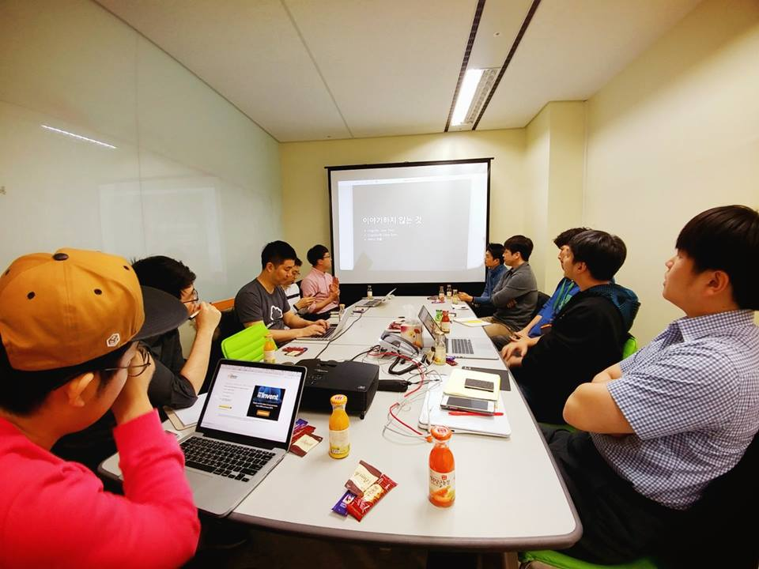

# AWS 유저그룹 소모임

## 강남 지역 모임

### 강남 초급자 모임

### 강남 중급자 모임

### 강남 SE 모임

- 2017년 1월 11일
  - [한종원님 - HB Smith에서는 AWS 이렇게 사용한다](http://www.slideshare.net/addnull/hb-smith-aws)
  - [권민재님 - AWS 회고](https://speakerdeck.com/mingrammer/cobo-seobeo-gaebaljayi-aws-hoego)
  - [윤제상님 - AWS Lambda를 이용한 CI/CD 기법](http://www.slideshare.net/jesangyoon/aws-lambda-cicd)
  - 

### 강남 자격증 취득 준비모임 

## 판교 지역 모임

### 판교 초급자 모임

### 판교 중급자 모임

- 2017년 1월 6일
  - [AWS Cognito Federation Identity의 사용법과 역할 - 박진언](https://jinunpark.github.io/awskrug_20170106_introduction_to_aws_cognito)
  - [클라우드에서의 보안 - 정도현](http://www.slideshare.net/AmazonWebServices/intro-to-aws-security-50364629)
  - [AWS re:invent 2016 후기 - 정창훈](http://www.slideshare.net/seapy/aws-reinvent-2016)
  - [OpenSSL에 얽힌 비화](https://coolspeed.wordpress.com/2015/02/16/unseeable_comrade_in_arms/)
  - 

